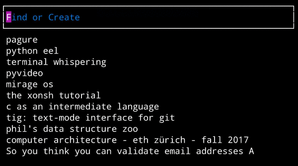

# Terminal Velocity 3

Terminal Velocity 3 is a TUI application for managing-plain text notes.
It combines finding and creating notes in a single minimal interface and
delegates the note-taking itself to your `$EDITOR`.

The interface concept is taken from [Notational
Velocity](http://notational.net/).

This is an active fork and **Python 3** port of
[terminal-velocity-notes/terminal_velocity](https://github.com/terminal-velocity-notes/terminal_velocity).
